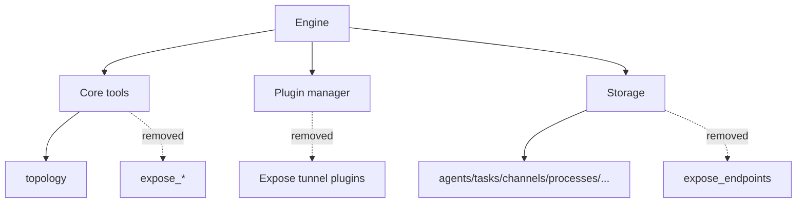

# Remove Expose Module

The runtime no longer includes the expose subsystem. This change removes:

- the `Exposes` facade and its `expose_*` tools
- expose endpoint persistence and related topology/observation payloads
- expose-only tunnel plugins (`local-expose`, `cloudflare-tunnel`, `custom-tunnel`, `tailscale`)

Result:

- plugin API no longer includes expose-provider registration
- topology output no longer reports `exposes` or `exposeCount`
- topography observations no longer emit expose lifecycle events
