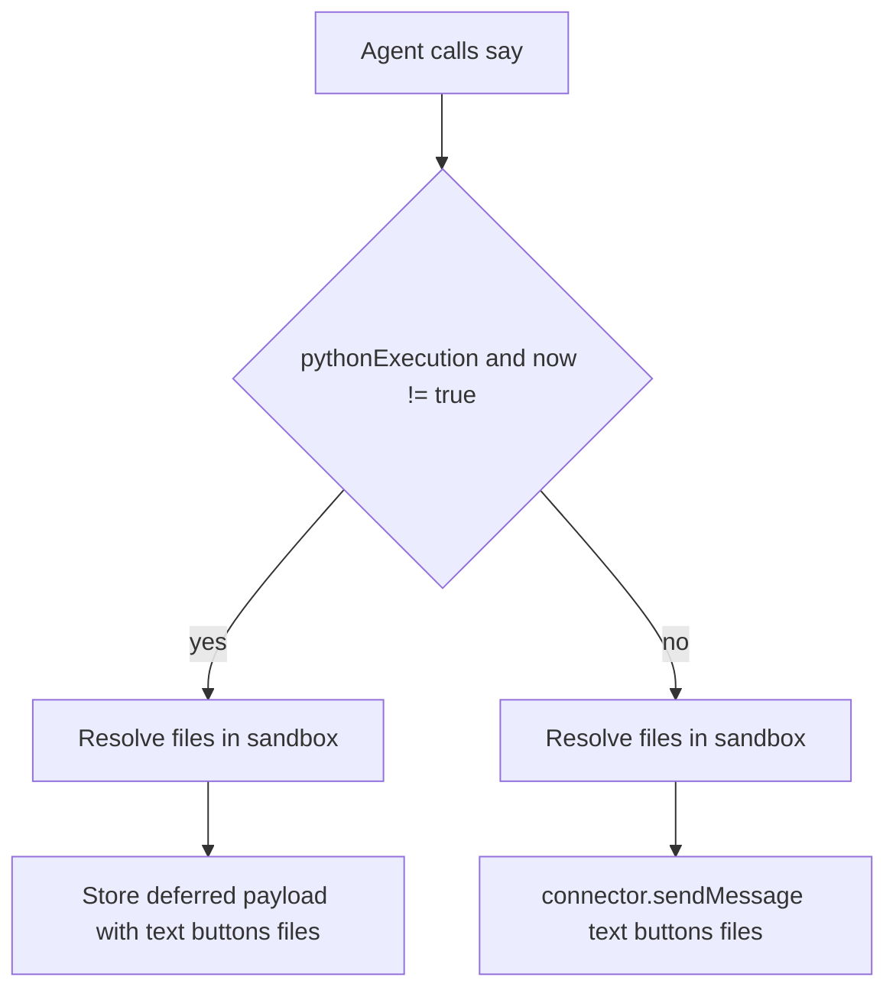
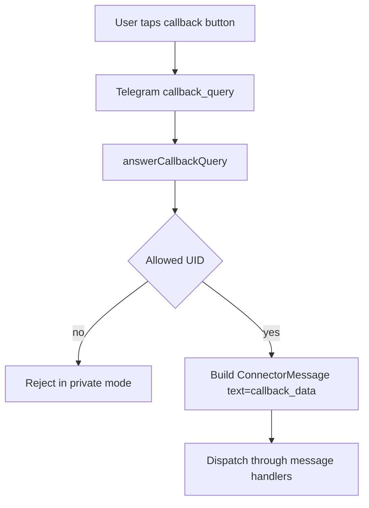
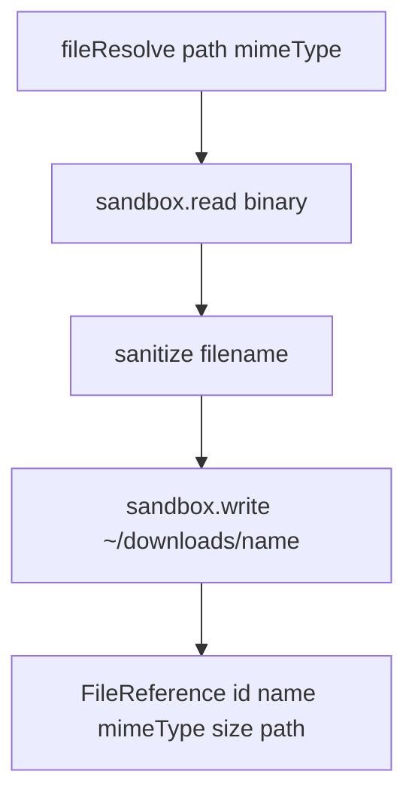

# Say Tool Buttons and Attachments

## Summary
- Extended `say` to accept `buttons` (`url` and `callback`) and `files` attachments.
- Added Telegram callback-query handling so callback button clicks are routed back as incoming messages.
- Extracted sandbox file-resolution logic to shared `fileResolve()` and reused it in `send_file`.

## Message Flow

## Telegram Callback Flow

## Shared File Resolution

