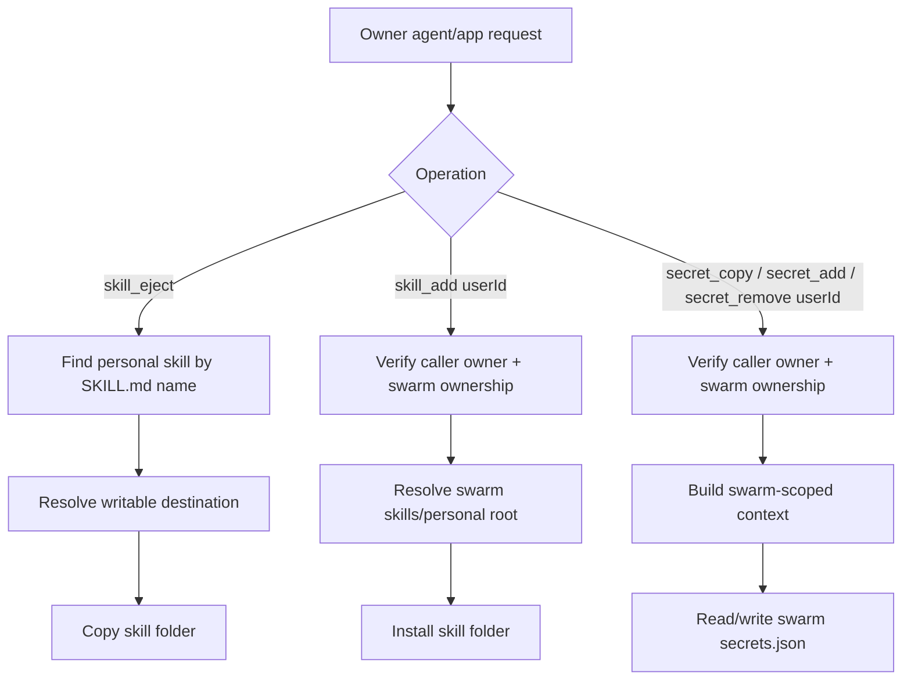

# Swarm Skill and Secret Tools

## Summary
- Added tool `skill_eject` to copy a personal skill folder to a sandbox path.
- Extended `skill_add` with optional `userId` to install into a caller-owned swarm.
- Added tool `secret_copy` to copy one owner secret to a caller-owned swarm.
- Extended `secret_add` and `secret_remove` with optional `userId` for swarm-scoped operations.
- Added API endpoint `POST /skills/eject`.
- Added swarm secret API endpoints under `/swarms/:nametag/secrets/*`.

## Flow

## API Endpoints
- `POST /skills/eject`
- `GET /swarms/:nametag/secrets`
- `POST /swarms/:nametag/secrets/copy`
- `POST /swarms/:nametag/secrets/create`
- `POST /swarms/:nametag/secrets/:name/update`
- `POST /swarms/:nametag/secrets/:name/delete`
