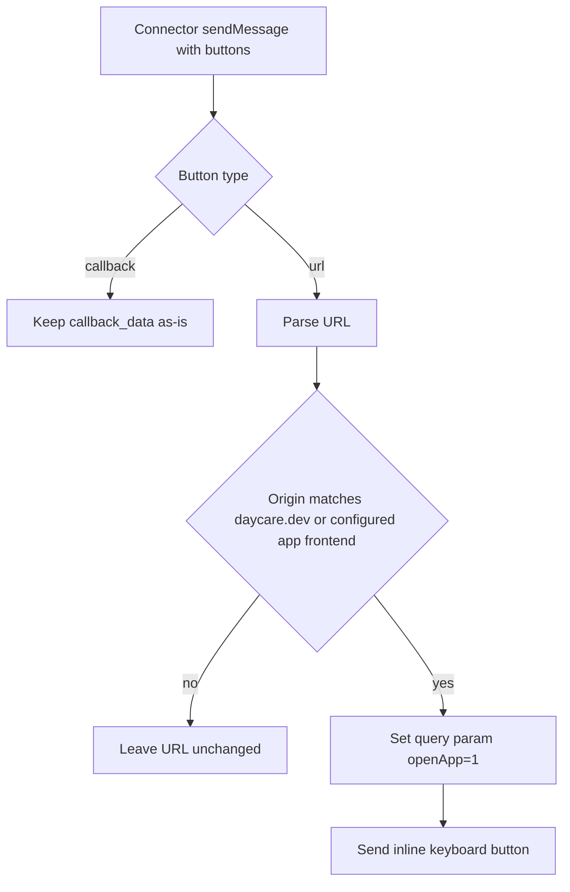

# Telegram URL Button App-Open Flag

Superseded on 2026-03-06 by `doc/20260306-telegram-webapp-inline-buttons.md`.

## Summary
- Added Telegram URL-button normalization for Daycare frontend links.
- If a URL button points to `https://daycare.dev` or the configured Telegram app frontend origin, `openApp=1` is appended.
- Markdown/body links are unchanged; only explicit URL buttons are rewritten.

## Button URL Flow

## Scope
- Applied in Telegram connector URL button rendering only.
- No changes to markdown link rendering logic.
