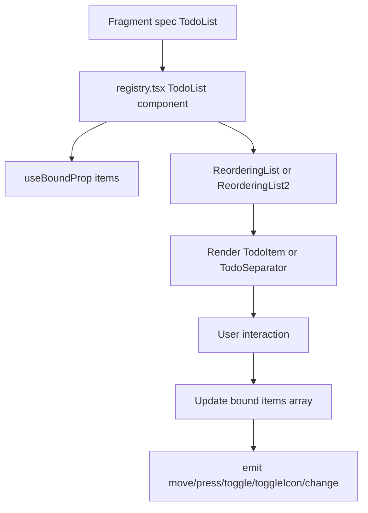

# TodoList Fragment Registry

Implemented a new `TodoList` fragment component in the app-side fragment catalog and registry.

## What changed

- Added `TodoList` schema to `packages/daycare-app/sources/fragments/catalog.ts`.
- Added `TodoItem` and `TodoSeparator` internal fragment components:
  - `packages/daycare-app/sources/fragments/TodoItem.tsx`
  - `packages/daycare-app/sources/fragments/TodoSeparator.tsx`
- Added todo state/config types in `packages/daycare-app/sources/fragments/TodoListTypes.ts`.
- Extracted shared icon rendering helper to `packages/daycare-app/sources/fragments/iconRender.tsx`.
- Wired `TodoList` into `packages/daycare-app/sources/fragments/registry.tsx` with:
  - state binding (`items`)
  - inline updates (`toggle`, `toggleIcon`, `change`)
  - drag reordering (`move`) via `ReorderingList`/`ReorderingList2`
  - `press` emission for row/separator tap
- Added a shared todo row-height constant:
  - `packages/daycare-app/sources/views/todos/todoHeight.ts`
  - reused by `TodoView`, `TodoItem`, `TodoSeparator`, and registry list defaults.

## Tests added

- `packages/daycare-app/sources/fragments/catalog.spec.ts`
- `packages/daycare-app/sources/fragments/TodoItem.spec.ts`
- `packages/daycare-app/sources/fragments/TodoSeparator.spec.ts`
- `packages/daycare-app/sources/fragments/registry.spec.ts`

## Flow

