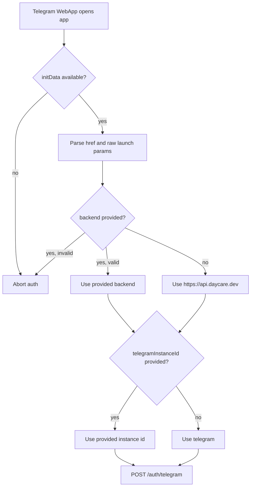

# App Default Telegram Auth Context

The app now defaults Telegram WebApp auth to the production backend and default Telegram connector id when launch parameters are omitted.

## Behavior

- Missing `backend` now resolves to `https://api.daycare.dev`.
- Missing `telegramInstanceId` now resolves to `telegram`.
- Invalid explicit backend values still fail parsing instead of silently changing targets.

