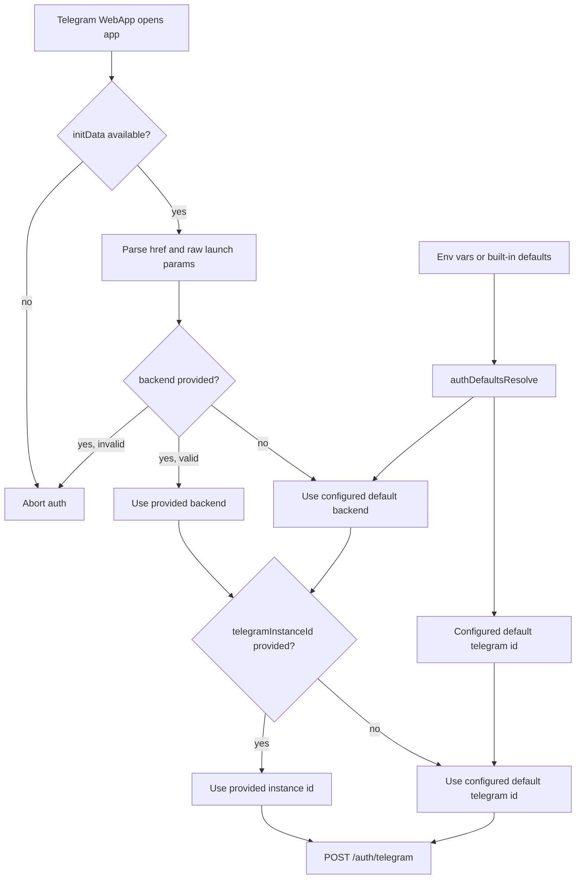

# App Default Telegram Auth Context

The app now defaults Telegram WebApp auth to the production backend and default Telegram connector id when launch parameters are omitted. Those defaults are configurable through Expo app config.

## Behavior

- Missing `backend` now resolves to `https://api.daycare.dev`.
- Missing `telegramInstanceId` now resolves to `telegram`.
- `packages/daycare-app/app.config.js` reads `EXPO_PUBLIC_DAYCARE_DEFAULT_BACKEND_URL` and `EXPO_PUBLIC_DAYCARE_DEFAULT_TELEGRAM_INSTANCE_ID` (with `DAYCARE_APP_*` aliases available during config evaluation).
- The runtime auth parser reads those environment-backed values before falling back to the built-in production defaults.
- Invalid explicit backend values still fail parsing instead of silently changing targets.

