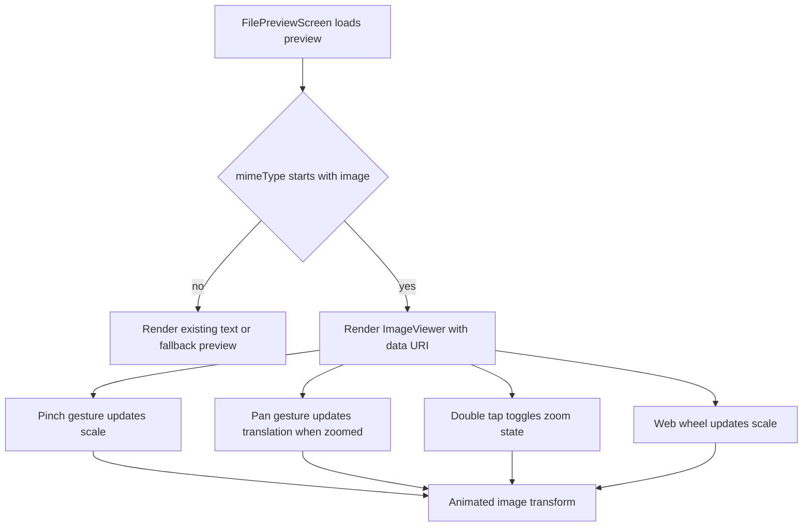

# App Image Preview Zoom

## Summary
- Adds an interactive `ImageViewer` to the app file preview screen for image files.
- Replaces the static `expo-image` preview with pinch, pan, double-tap, and web wheel zoom.

## Flow

