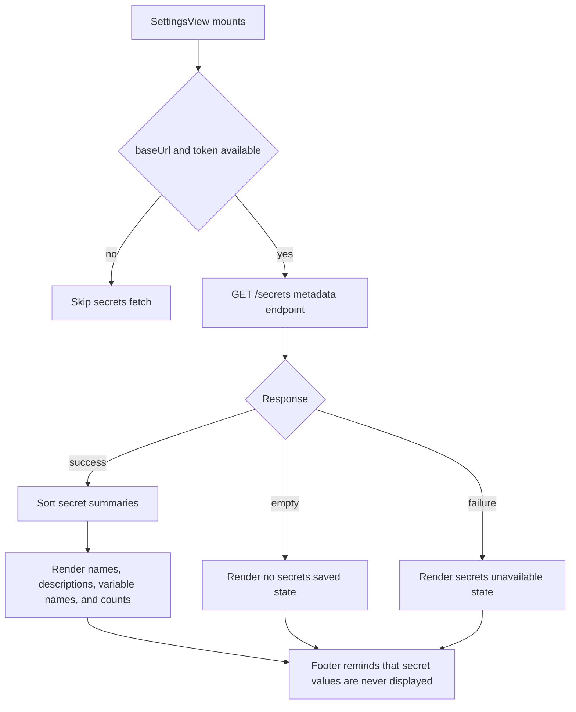

# App Secrets Presence Viewer

## Summary
- Adds a secrets section to app settings.
- Uses the existing metadata-only secrets API so the UI can show which secrets exist without rendering any secret values.

## Flow

