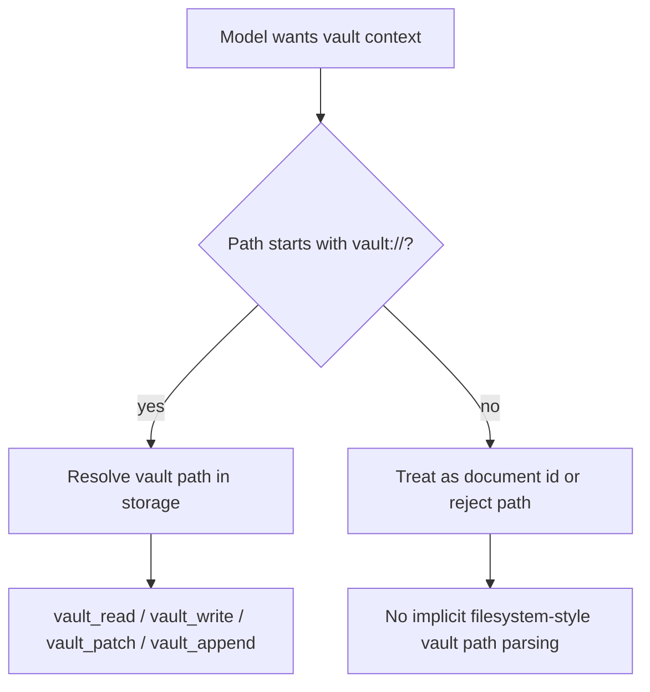
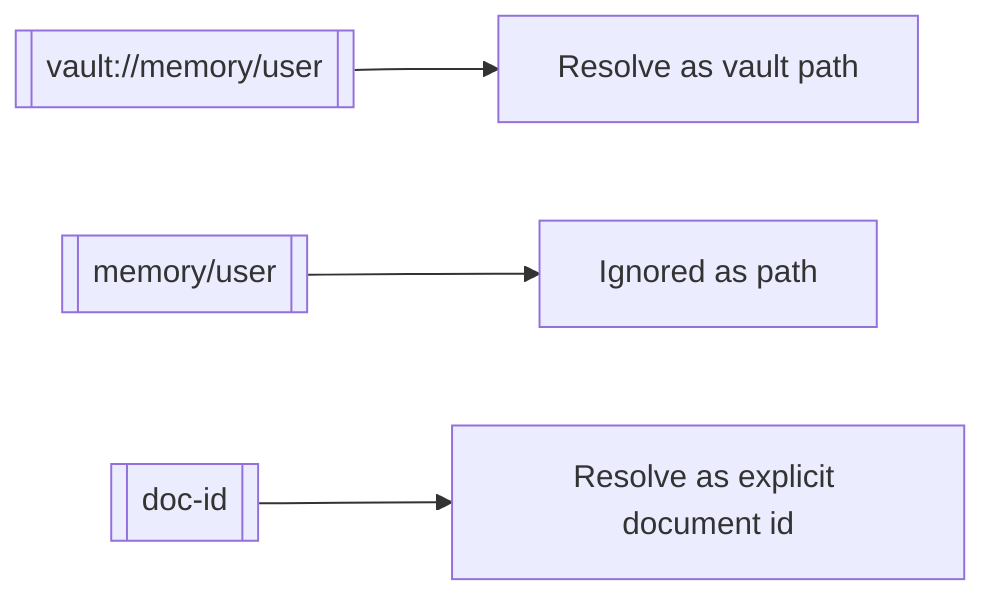

# Document Path Prefix

This change makes vault paths require the explicit `vault://` prefix instead of reusing filesystem-style `~/...`.

## What Changed

- Vault path parsing now accepts only `vault://...`
- Vault path rendering now emits `vault://...`
- Vault tools and prompts now instruct models to use `vault://system/*`, `vault://memory/*`, and similar vault paths
- Wiki-link path references now resolve only when written as `[[vault://...]]`
- Bare wiki links remain document IDs only; implicit path fallback was removed

## Why

Using `~/...` for both the sandbox filesystem and the vault made the model conflate two different storage systems. `vault://...` is visibly distinct and avoids accidental filesystem reads and writes when the intent is to use vault tools.

## Flow

## Wiki Links

