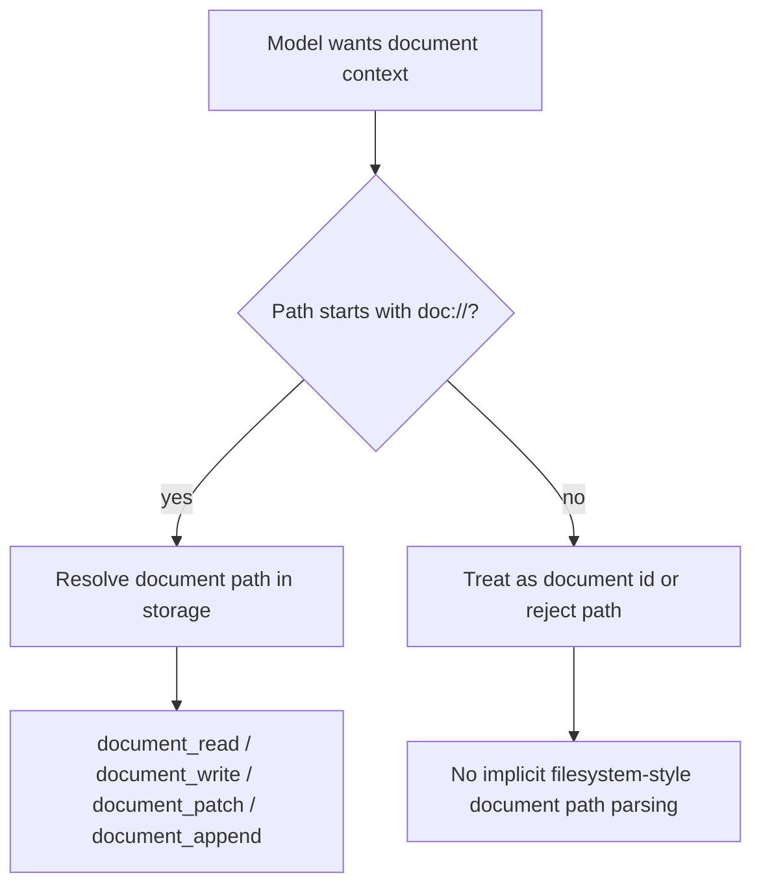
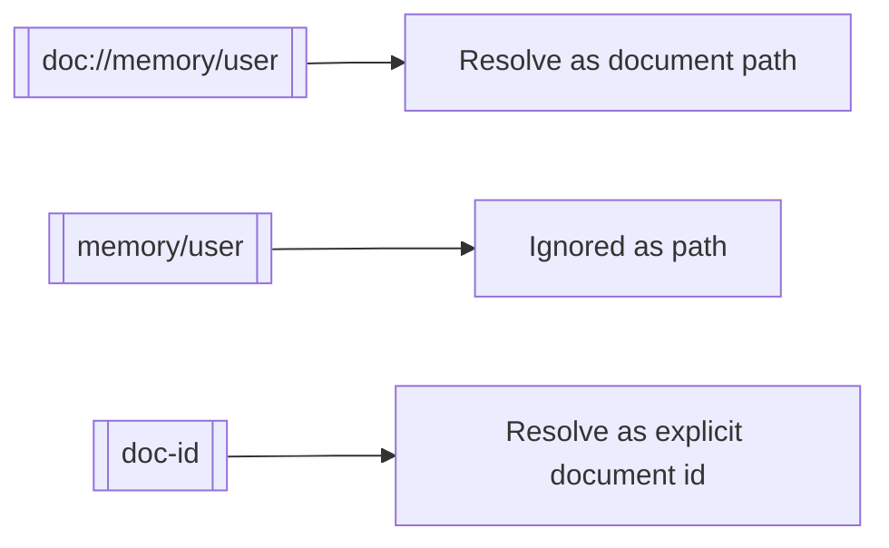

# Document Path Prefix

This change makes document-store paths require the explicit `doc://` prefix instead of reusing filesystem-style `~/...`.

## What Changed

- Document path parsing now accepts only `doc://...`
- Document path rendering now emits `doc://...`
- Document tools and prompts now instruct models to use `doc://system/*`, `doc://memory/*`, and similar document-store paths
- Wiki-link path references now resolve only when written as `[[doc://...]]`
- Bare wiki links remain document IDs only; implicit path fallback was removed

## Why

Using `~/...` for both the sandbox filesystem and the document store made the model conflate two different storage systems. `doc://...` is visibly distinct and avoids accidental filesystem reads and writes when the intent is to use document tools.

## Flow

## Wiki Links

