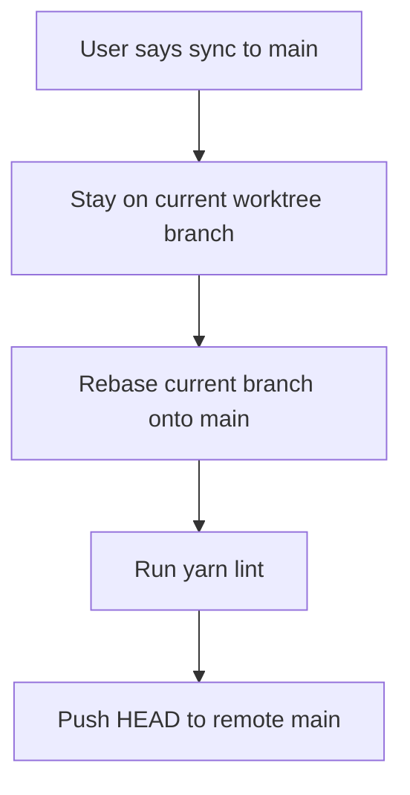

# Sync To Main Semantics

Date: 2026-03-06

## Summary
- Defined `"sync to main"` in operator guidance.
- The phrase now means: stay on the current worktree branch, rebase it onto `main`, run `yarn lint`, then push `HEAD` to the remote `main` branch.
- This avoids unnecessary branch switches while still landing the current branch contents on `main`.

## Flow

