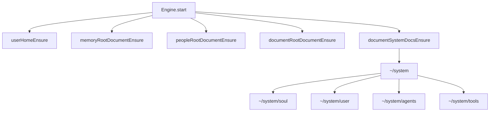
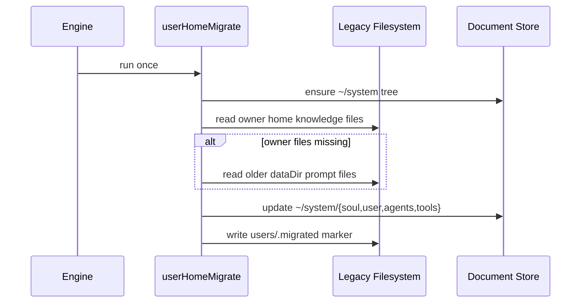
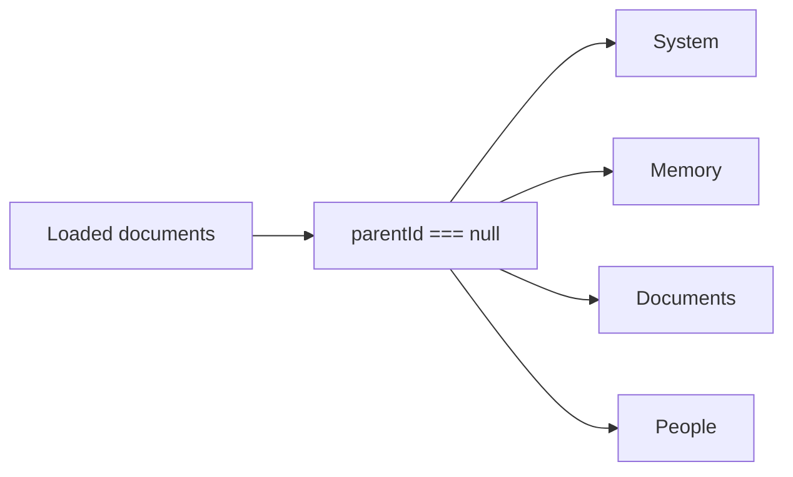

# System Prompt Document Store Migration

This change moves core prompt persistence from per-user filesystem files under `~/knowledge/` into versioned documents under `~/system/`.

## What Changed

- Engine startup now ensures `~/system` and its child documents: `soul`, `user`, `agents`, `tools`.
- System prompt rendering reads those documents from storage and falls back to bundled defaults when needed.
- User-home setup no longer creates `knowledge/` or filesystem `memory/` directories.
- Legacy prompt files are migrated into the owner user's `~/system/*` documents once.
- The `/prompts` API surface was removed because prompt editing now belongs to the document store.
- The app sidebar now lists all root documents, so `System`, `Memory`, `Documents`, and `People` are visible together.

## Startup Flow

## Legacy Migration

## Sidebar Behavior

