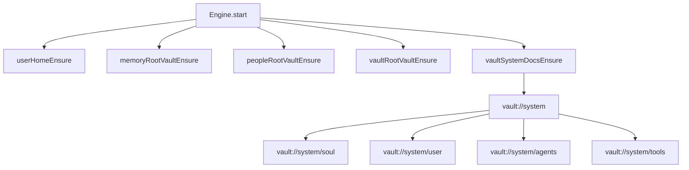
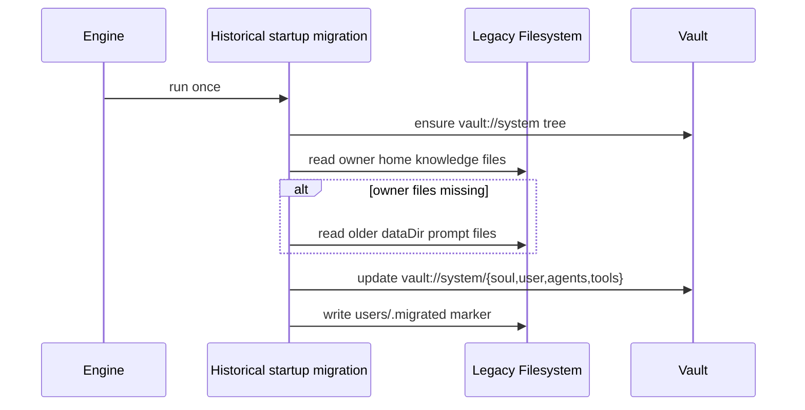
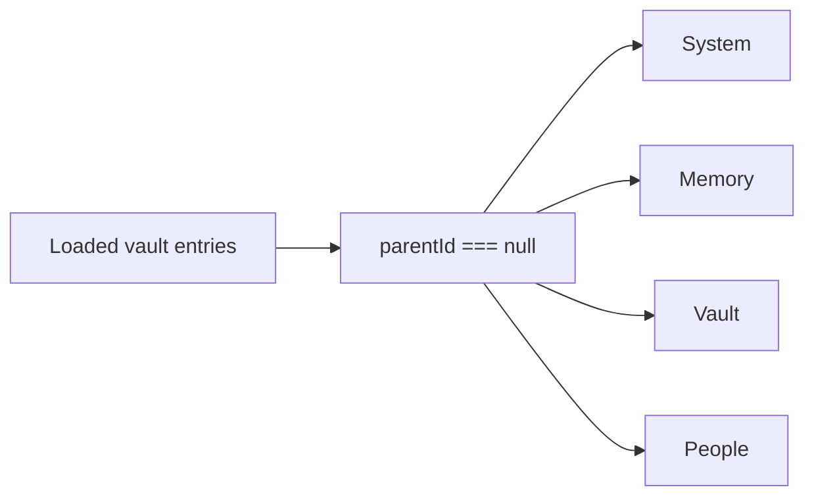

# System Prompt Vault Migration

Historical note: the one-time startup migration described below was removed on 2026-03-08 after rollout completed.

This change moves core prompt persistence from per-user filesystem files under `~/knowledge/` into versioned vault entries under `vault://system/`.

## What Changed

- Engine startup now ensures `vault://system` and its child entries: `soul`, `user`, `agents`, `tools`.
- System prompt rendering reads those entries from storage and falls back to bundled defaults when needed.
- User-home setup no longer creates `knowledge/` or filesystem `memory/` directories.
- Legacy prompt files are migrated into the owner user's `vault://system/*` entries once.
- The `/prompts` API surface was removed because prompt editing now belongs to the vault.
- The app sidebar now lists all root vault entries, so `System`, `Memory`, `Vault`, and `People` are visible together.

## Startup Flow

## Legacy Migration

## Sidebar Behavior

