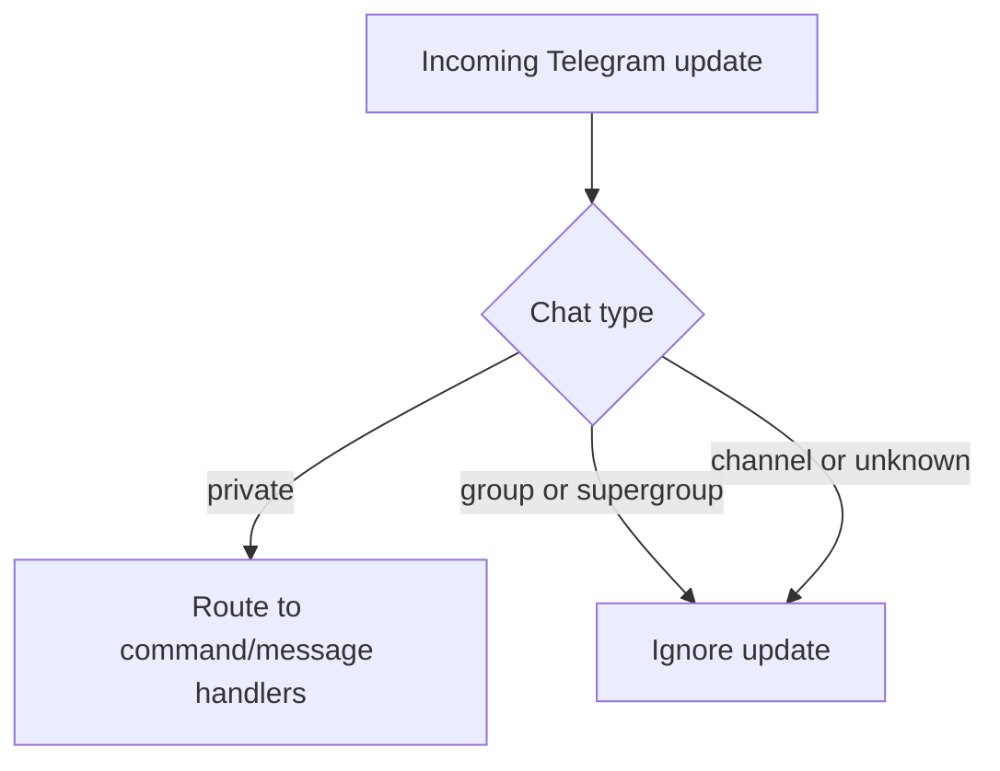

# Telegram Group Processing Disabled

Date: 2026-03-06

## Summary
- Disabled incoming Telegram processing for group and supergroup chats.
- Telegram connector now only routes private-chat messages and callback queries into the engine.
- This keeps Telegram user connector keys aligned with private-chat auth until group routing is redesigned.

## Flow

