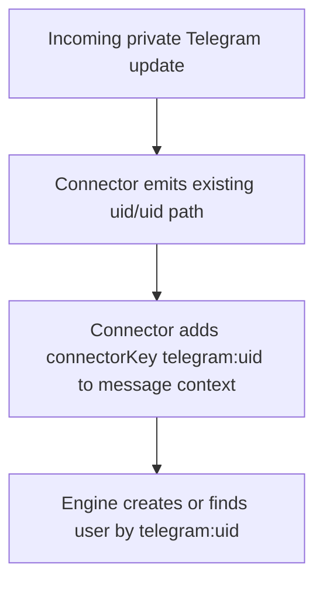

# Telegram Connector Key Hints

Date: 2026-03-06

## Summary
- Kept Telegram private-chat paths unchanged as `/<daycareUserId>/telegram/<telegramUid>/<telegramUid>`.
- Added a generic `connectorKey` hint on incoming connector message context.
- Engine now uses that key for connector-user lookup and creation, so user connector keys stay aligned with `telegram:<uid>` without inferring Telegram semantics from the path.

## Flow

