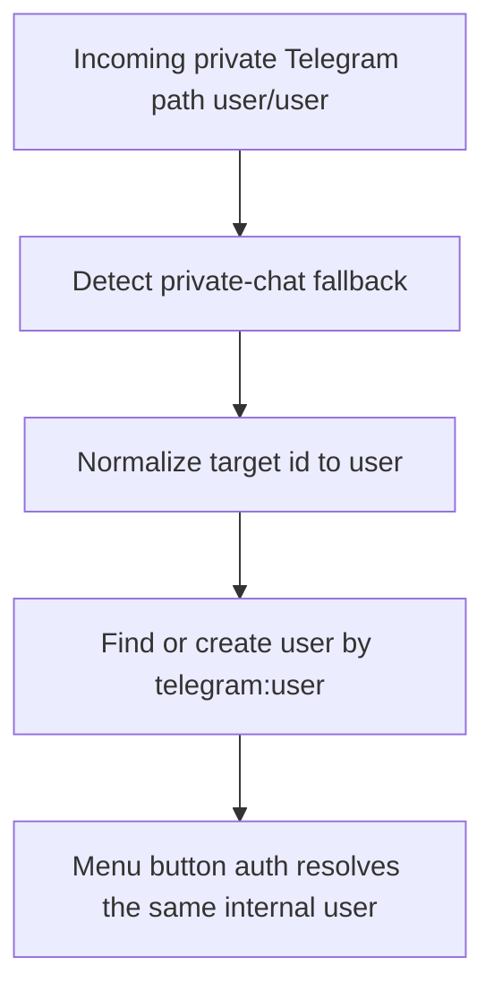

# Telegram Private Chat Target Normalization

Date: 2026-03-06

## Summary
- Fixed incoming Telegram private-chat paths shaped like `<user>/<user>`.
- The engine now creates or finds the user by the normalized Telegram id `<user>` instead of persisting a duplicate connector key under `<user>/<user>`.
- This keeps Telegram menu-button auth and private-message routing attached to the same internal Daycare user.

## Flow

