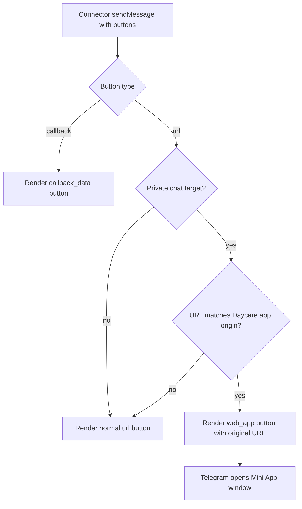

# Telegram WebApp Inline Buttons

Date: 2026-03-06

## Summary
- Replaced Telegram URL-button rewriting for Daycare app links with real `web_app` inline buttons.
- Daycare app links now open inside Telegram's Mini App window in private chats.
- Group chats and non-Daycare links still use normal URL buttons because Telegram only supports Mini App buttons in private chats.

## Button Selection Flow

## Scope
- Applied only in Telegram connector inline button rendering.
- Menu-button Mini App behavior remains unchanged.
- External links continue to render as standard URL buttons.
