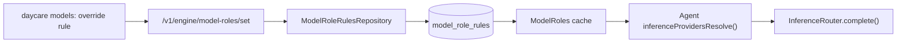

# Model Role Rule Reasoning

This change extends DB-backed `model_role_rules` overrides with an optional `reasoning` level so dynamic role rules can select both a model and a reasoning depth.

## What changed

- Added nullable `reasoning` to the `model_role_rules` table
- Updated repository and IPC payloads to read/write the new field
- Changed runtime rule resolution to return `{ model, reasoning? }`
- Updated the `daycare models` override-rule flow to capture and display reasoning

## Compatibility

- Existing rows continue to work with `reasoning = null`
- Null reasoning means "use provider/model default"
