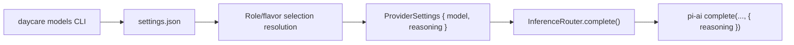

# Role And Flavor Reasoning Levels

This change lets Daycare store a `reasoning` level alongside role-based model assignments and flavor mappings, then forward that level to `pi-ai` as the provider runtime `reasoning` option.

## Config shape

- `settings.models.<role>` now stores `{ model, reasoning? }`
- `settings.modelFlavors.<flavor>` now stores `{ model, description, reasoning? }`
- legacy string role entries are normalized to `{ model }` on read

```json
{
  "models": {
    "task": {
      "model": "openai/gpt-5",
      "reasoning": "high"
    }
  },
  "modelFlavors": {
    "coding": {
      "model": "anthropic/claude-opus-4-5",
      "description": "High-capability coding and planning",
      "reasoning": "high"
    }
  }
}
```

## Flow



## Notes

- Built-in flavors (`small`, `normal`, `large`) still select models by catalog size.
- Custom flavors can now pin both provider/model and reasoning level.
- If `reasoning` is omitted, Daycare leaves provider/model defaults in place.
