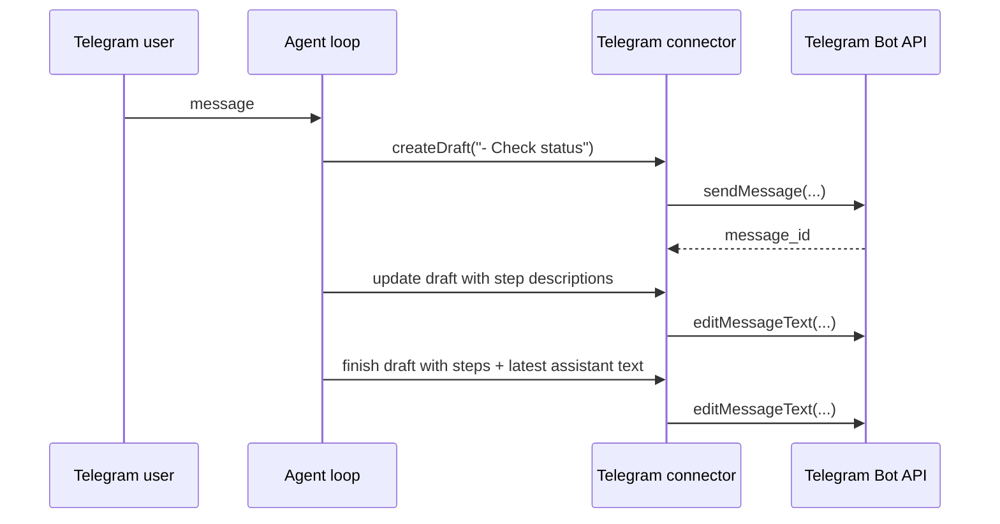
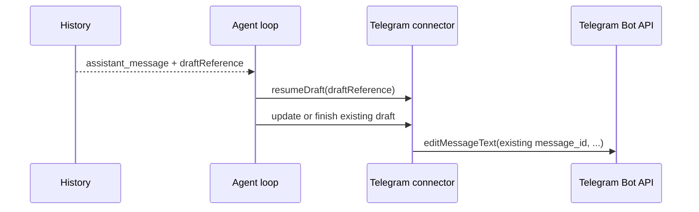

# Telegram Draft Messages

Telegram foreground conversations now keep a single editable bot message open while `run_python` is executing. The draft shows only the user-facing `run_python.description` steps, followed by the latest assistant text, and the connector edits that same Telegram message in place instead of sending separate intermediate replies.

## What Changed

- Added a small optional connector draft API to the core connector contract.
- Taught the Telegram connector to create text-only drafts with `sendMessage` and update them with `editMessageText`.
- Updated the agent loop to render only `run_python.description` step labels into a live draft when the connector supports drafts.
- Ordered the draft surface so step descriptions render first and assistant text renders after them.
- Persisted the Telegram draft reference on `assistant_message` history so pending-phase recovery can reattach to the same Telegram message after resume or restart.

## Notes

- Drafts are text-only; file sends and button sends still use normal outbound messages.
- The draft text is still a connector surface, but the `assistant_message` history now stores a tiny draft reference so Telegram can resume editing the same message.
- Inner tool names and raw arguments are intentionally excluded from Telegram drafts.
