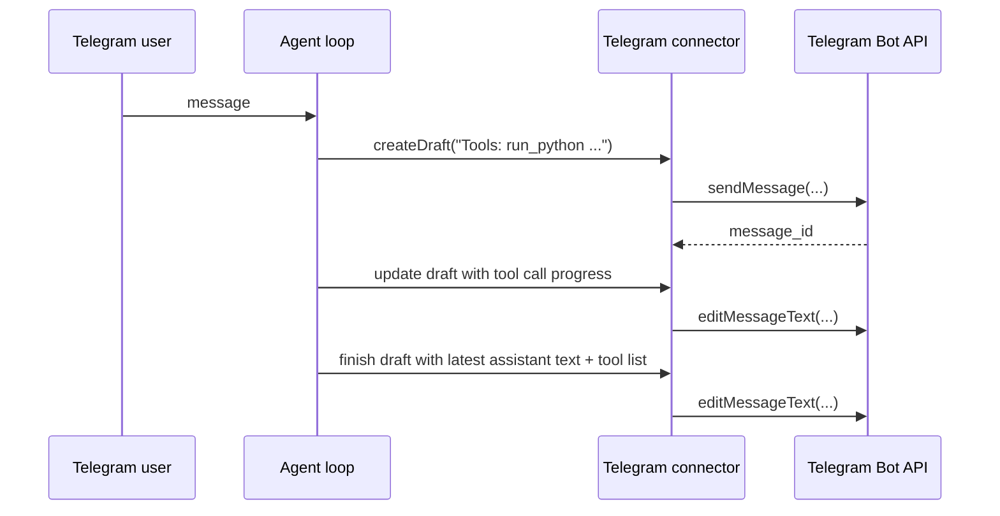

# Telegram Draft Messages

Telegram foreground conversations now keep a single editable bot message open while `run_python` is executing. The draft shows the latest assistant text plus tool activity, and the connector edits that same Telegram message in place instead of sending separate intermediate replies.

## What Changed

- Added a small optional connector draft API to the core connector contract.
- Taught the Telegram connector to create text-only drafts with `sendMessage` and update them with `editMessageText`.
- Updated the agent loop to render assistant text plus tool progress into a live draft when the connector supports drafts.
- Kept persisted history unchanged: the app still reads normal `assistant_message`, `rlm_start`, and `rlm_tool_call` records.

## Notes

- Drafts are text-only; file sends and button sends still use normal outbound messages.
- The draft text is a connector surface only. It does not change agent history storage or app history parsing.
