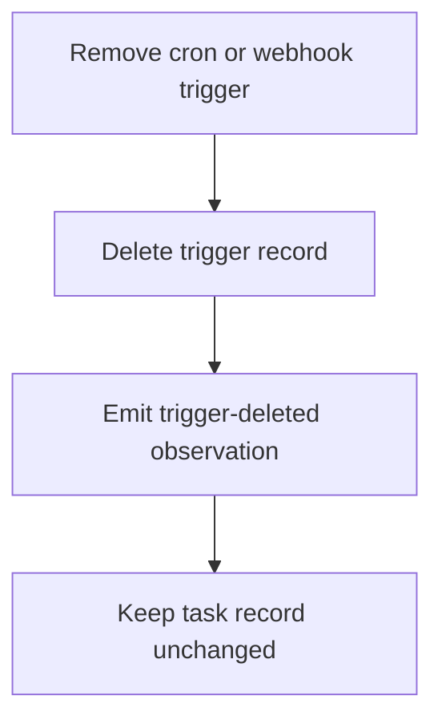
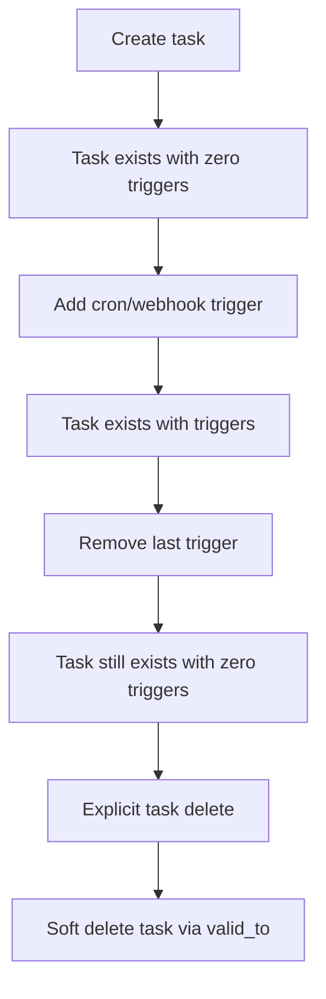

# Trigger Delete Keeps Task

## Summary

Deleting the last cron or webhook trigger no longer soft-deletes the task.

- Tasks remain valid without any trigger.
- Trigger deletion now affects only the trigger record.
- Added facade-level regression tests for cron and webhook deletion.

## Trigger Removal Flow

## Task Lifecycle

