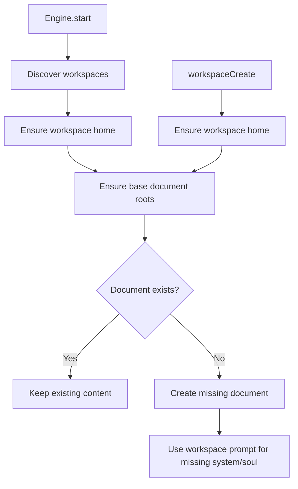

# Workspace Document Bootstrap

Base document roots are now bootstrapped for every workspace both when the server starts and when a workspace is created.
The bootstrap is fully idempotent: if a target document or folder already exists, it is left untouched.

Seeded roots:

- `doc://memory`
- `doc://people`
- `doc://document`
- `doc://system`
- `doc://system/soul`
- `doc://system/user`
- `doc://system/agents`
- `doc://system/tools`

For workspace creation and workspace startup repair, `doc://system/soul` uses the workspace system prompt only when that
document is missing. Existing workspace soul documents are preserved as-is.

