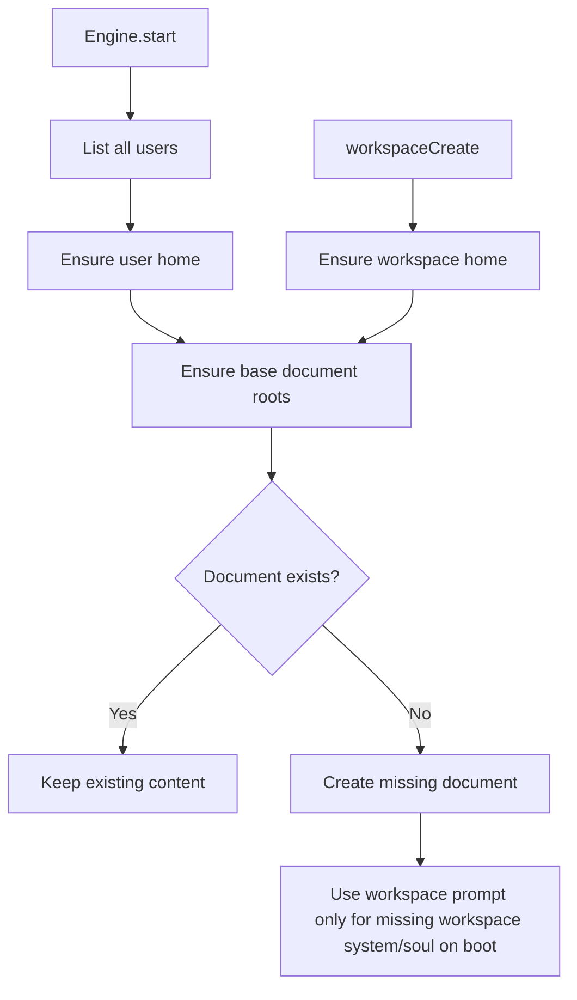

# Workspace Document Bootstrap

Base document roots are now bootstrapped for every stored user on server boot and for every workspace at creation time.
The bootstrap is fully idempotent: if a target document or folder already exists, it is left untouched.

Seeded roots:

- `doc://memory`
- `doc://people`
- `doc://document`
- `doc://system`
- `doc://system/soul`
- `doc://system/user`
- `doc://system/agents`
- `doc://system/tools`

For server-boot repair, workspace users seed `doc://system/soul` from the workspace system prompt only when that
document is missing. Workspace creation itself keeps the bundled `SOUL.md` seed. Existing soul documents are preserved
as-is for both regular users and workspace users.

