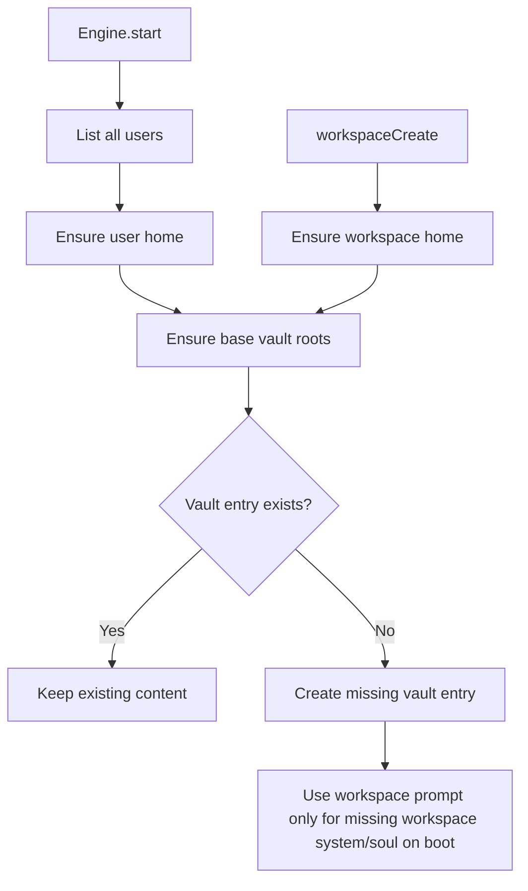

# Workspace Document Bootstrap

Base vault roots are now bootstrapped for every stored user on server boot and for every workspace at creation time.
The bootstrap is fully idempotent: if a target vault entry or folder already exists, it is left untouched.

Seeded roots:

- `vault://memory`
- `vault://people`
- `vault://vault`
- `vault://system`
- `vault://system/soul`
- `vault://system/user`
- `vault://system/agents`
- `vault://system/tools`

For server-boot repair, workspace users seed `vault://system/soul` from the workspace system prompt only when that
entry is missing. Workspace creation itself keeps the bundled `SOUL.md` seed. Existing soul entries are preserved
as-is for both regular users and workspace users.

