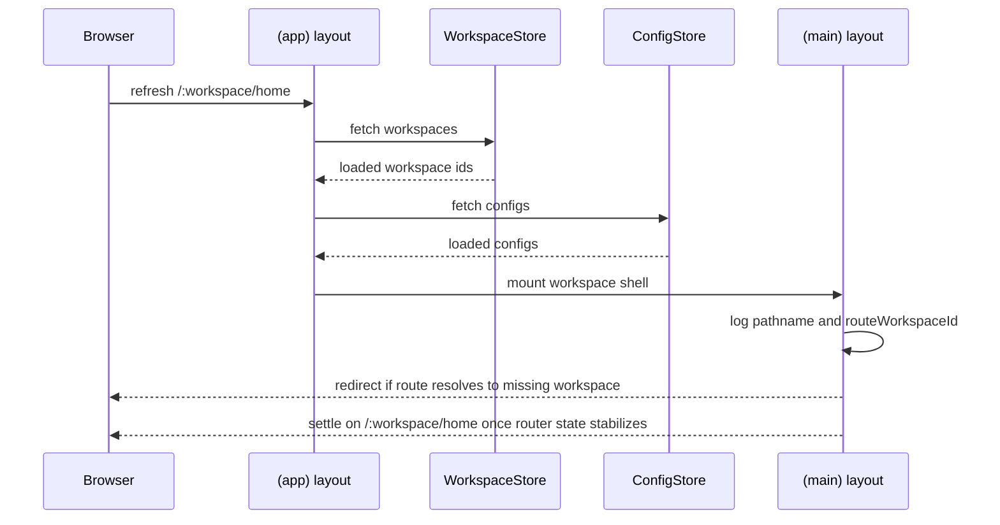

# App Workspace Refresh Debug Logging

## Summary

Added development-only route debug logging around authenticated app startup to trace the refresh bounce through `workspace-not-found`.

The logs record:

- app gate state in `(app)` layout
- workspace fetch start and success
- config fetch start and success
- the resolved pathname, workspace ids, and redirect branch in `(main)` layout

## Flow

## Log Labels

- `app-layout-state`
- `app-gate-block`
- `app-redirect`
- `workspaces-fetch-start`
- `workspaces-fetch-success`
- `configs-fetch-start`
- `configs-fetch-success`
- `main-layout-state`
