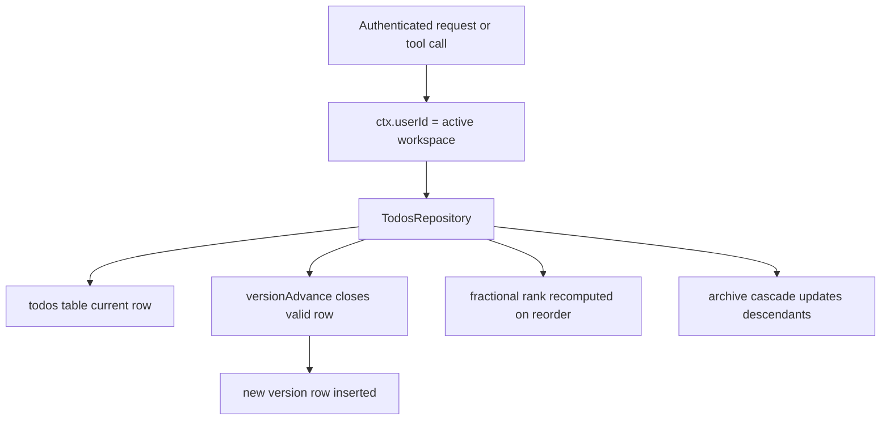

# Hierarchical Todos

Date: 2026-03-08

## Summary
- Added workspace-scoped hierarchical todos with temporal versioning.
- Todos support nested parents, fractional sibling ordering, archive cascade, and batch status updates.
- Exposed matching REST routes and core LLM tools: `todo_list`, `todo_create`, `todo_update`, `todo_reorder`, `todo_archive`, and `todo_batch_status`.

## Flow

## API and Tool Surface
- API routes:
  - `GET /todos`
  - `GET /todos/tree`
  - `POST /todos/create`
  - `POST /todos/:id/update`
  - `POST /todos/:id/reorder`
  - `POST /todos/:id/archive`
  - `POST /todos/batch-status`
- Tool routes mirror the same operations:
  - `todo_list`
  - `todo_create`
  - `todo_update`
  - `todo_reorder`
  - `todo_archive`
  - `todo_batch_status`

## Notes
- Workspace scope is derived from the authenticated app context or tool context, not from a free-form workspace id.
- Utility files were added under the existing `packages/daycare/sources/utils/` directory to match the current package layout.
