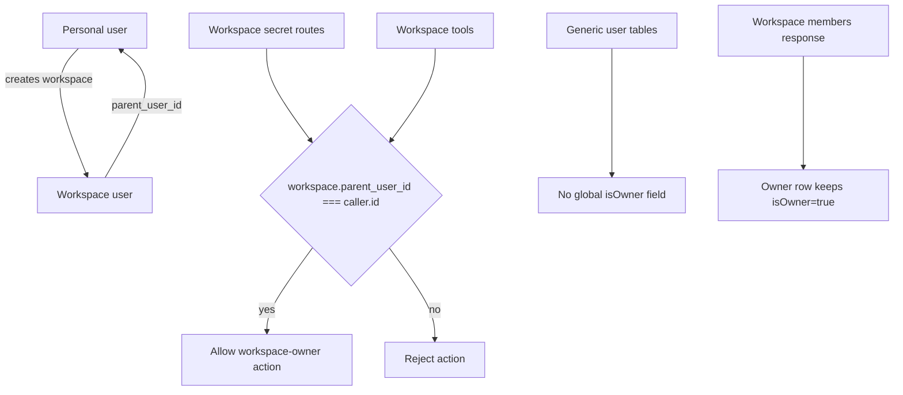

# Remove Global User Owner Flag

## Summary
- Removed the persisted `users.is_owner` column and its single-owner index.
- Generic user payloads no longer expose `isOwner`.
- Workspace management now authorizes from the actual ownership edge: `workspace.parent_user_id === caller.id`.
- Workspace member listings still expose `isOwner` so the UI can label the workspace owner row.

## Behavior
- New users are created without a global-owner flag.
- The legacy `findOwner()` fallback now resolves the earliest personal user (`isWorkspace === false && parentUserId === null`).
- Workspace secret management, workspace-targeted secret tools, and workspace skill installs now require the caller to own the target workspace.
- `workspace_create` is available to personal users, not workspace users.

