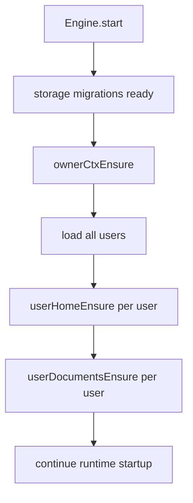

# Remove User Home Migration

The legacy `userHomeMigrate` startup step has been removed. All environments have already been migrated, so engine startup now only ensures user homes and document roots.

## What Changed

- Removed `userHomeMigrate` from engine startup.
- Deleted the obsolete migration source and its tests.
- Kept normal startup setup: `userHomeEnsure` and `userDocumentsEnsure`.

## Startup Flow

