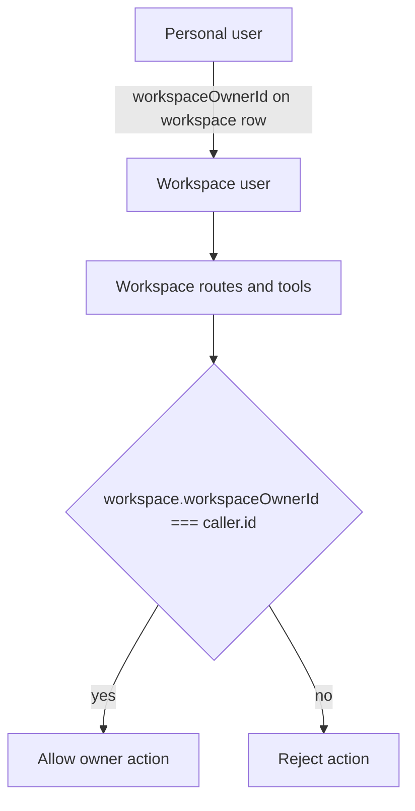

# Rename Workspace Owner Id

The `users` ownership edge has been renamed from `parentUserId` / `parent_user_id` to `workspaceOwnerId` / `workspace_owner_id` to make its purpose explicit in workspace flows.

## What Changed

- Renamed the user field in schema, storage records, API payloads, and workspace logic.
- Renamed repository helpers that look up owned workspaces.
- Added a storage migration to rename the persisted database column and recreate the ownership index.

## Ownership Flow

