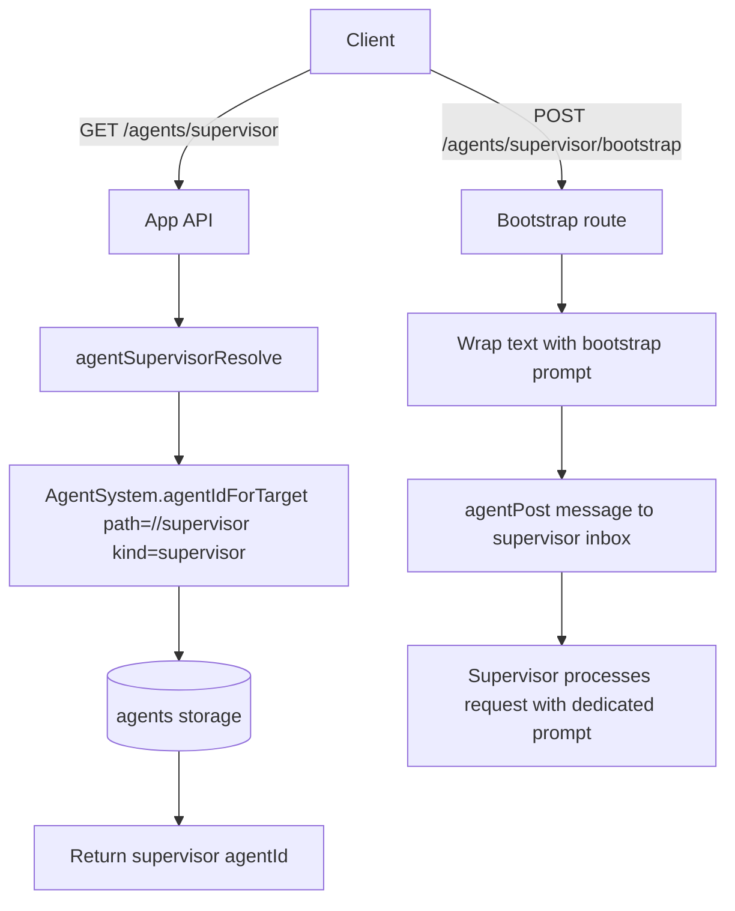

# Supervisor Agent Bootstrap

## Summary

Added a singleton `supervisor` agent kind for each user.

- The supervisor is always deployed at `/<uid>/supervisor`.
- It resolves through `GET /agents/supervisor`.
- It uses a dedicated bundled prompt focused on supervising, executing, and delegating work.
- It is treated as a first-class kind in reserved-path parsing, model-role tooling, and agent UIs.
- The client can send a bootstrap request through `POST /agents/supervisor/bootstrap`.
- Bootstrap text is wrapped with a small startup prompt before being queued as a normal agent message.

## Flow

