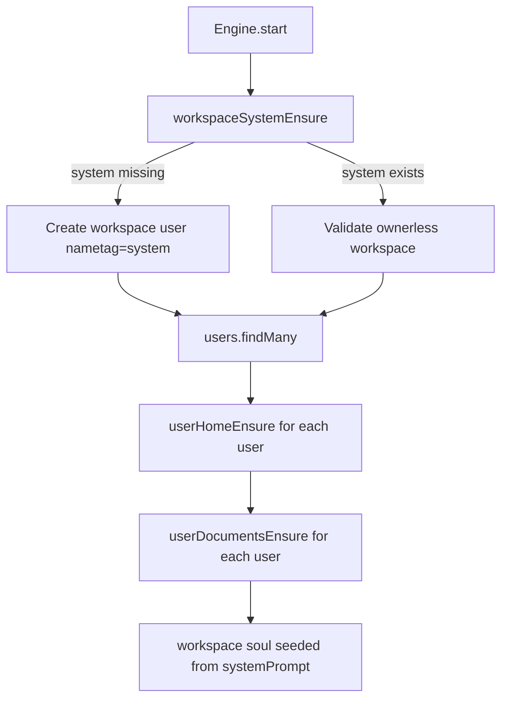

# System Workspace Bootstrap

Daycare now bootstraps a reserved ownerless `system` workspace during engine startup.

- The workspace is created only when the `system` nametag is missing.
- It is stored as a normal workspace user with `workspaceOwnerId = null`.
- Its initial configuration enables `homeReady` and `appReady`.
- The normal startup user bootstrap then creates its home and default documents.

