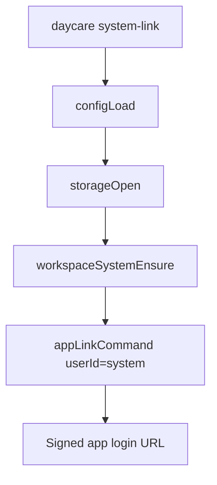

# System Workspace Link Command

Daycare now exposes a CLI command for generating an app login link for the reserved `##system##` workspace.

- Command: `daycare system-link`
- It opens storage from the configured settings file.
- It ensures the reserved `##system##` workspace record exists with user id `system`.
- It delegates directly to the normal app-link signer for `system`.

