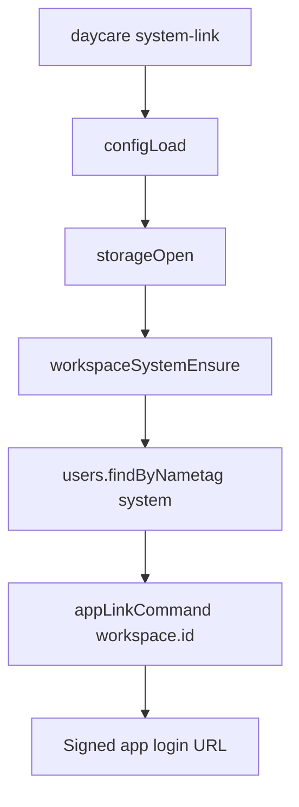

# System Workspace Link Command

Daycare now exposes a CLI command for generating an app login link for the reserved `system` workspace.

- Command: `daycare system-link`
- It opens storage from the configured settings file.
- It ensures the reserved `system` workspace record exists.
- It resolves the workspace user id and delegates to the normal app-link signer.

