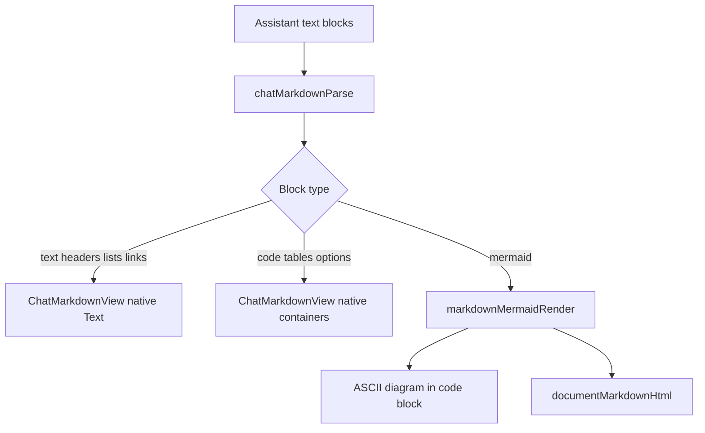

# App Chat Markdown Renderer

This change adds a native markdown renderer for assistant chat messages in the app and reuses the existing Mermaid ASCII rendering path instead of introducing a separate WebView-based Mermaid implementation.

## Flow

## Notes

- Assistant messages now render headers, lists, numbered lists, links, code fences, tables, horizontal rules, options blocks, and Mermaid fences.
- Mermaid rendering stays consistent with document rendering by sharing `markdownMermaidRender`.
- The chat renderer stays native, which avoids embedding a WebView per message.
