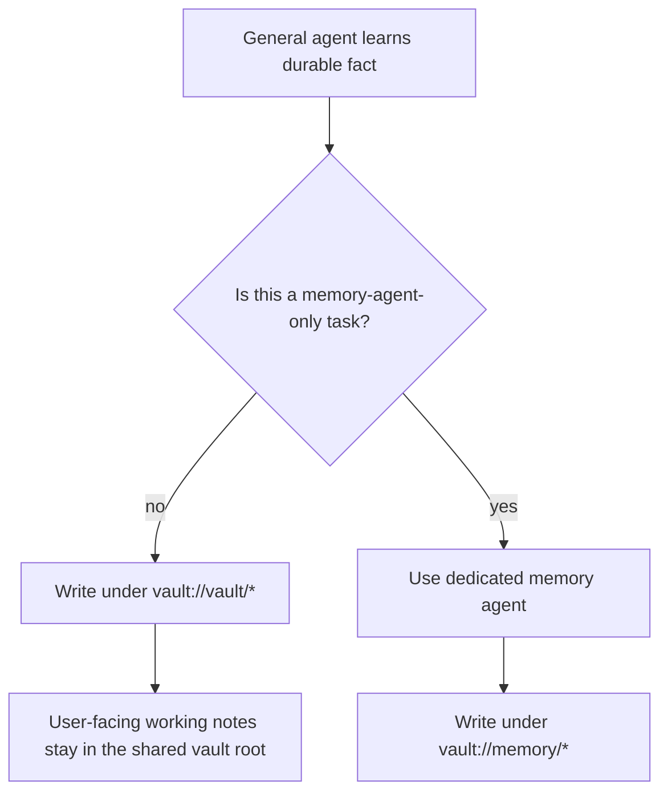

# Document Root Prompt Routing

## Summary

- Shared prompts now steer general agents toward `vault://vault/*` for durable working notes.
- `vault://memory/*` remains described as a vault path, but shared prompts now treat it as reserved for dedicated memory-agent writes.
- Supervisor bootstrap guidance now tells agents to create bootstrap entries under `vault://vault`.

## Flow

