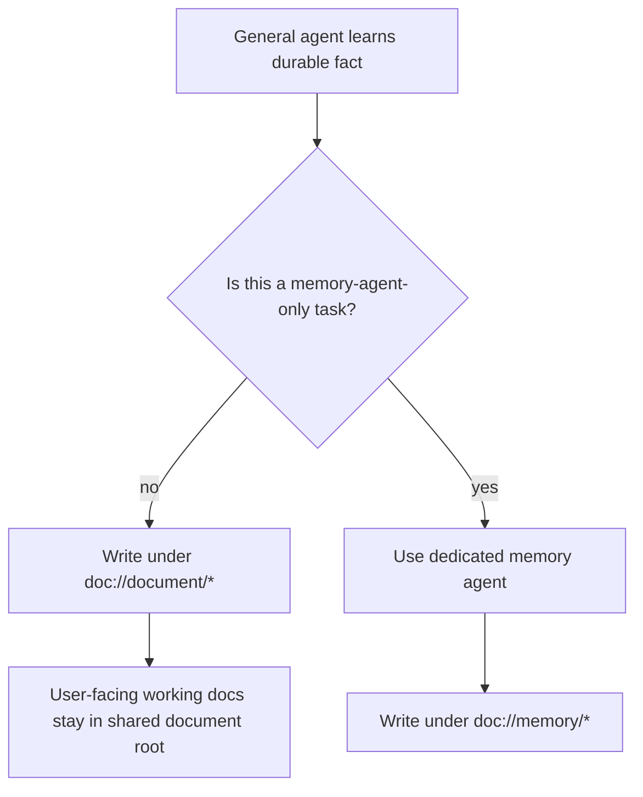

# Document Root Prompt Routing

## Summary

- Shared prompts now steer general agents toward `doc://document/*` for durable working notes.
- `doc://memory/*` remains described as a document-store path, but shared prompts now treat it as reserved for dedicated memory-agent writes.
- Supervisor bootstrap guidance now tells agents to create bootstrap documents under `doc://document`.

## Flow

