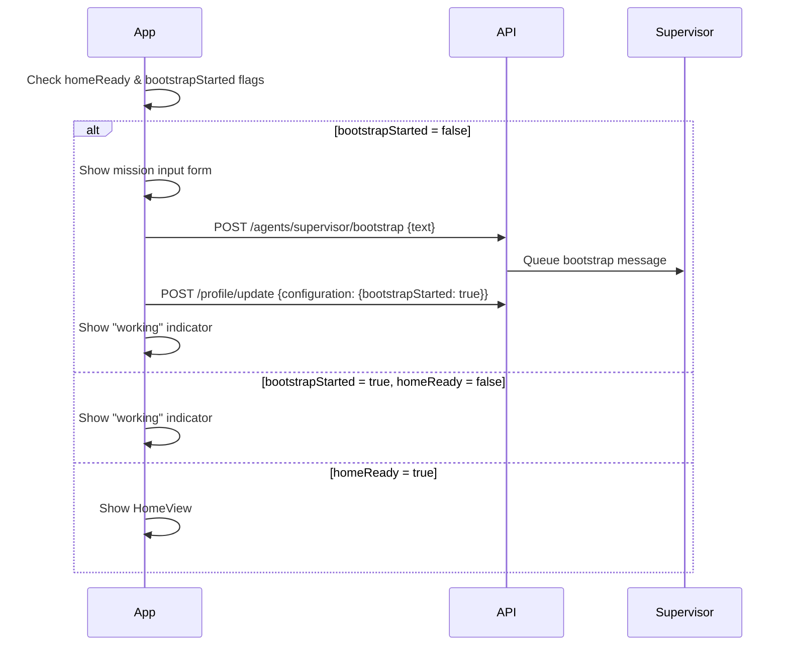

# Supervisor Onboarding Flow

Adds an onboarding screen that collects the user's mission and sends it to the supervisor agent for bootstrap processing.

## Flow

## Changes

### Backend
- Added `bootstrapStarted` flag to `UserConfiguration` type
- Updated normalization, validation, and schema defaults
- Added migration `20260309090000_user_configuration_bootstrap_started`
- Updated `userProfileUpdateTool` to support `bootstrapStarted` flag

### Frontend
- Created `supervisorBootstrap` API call module
- Created `configUpdate` API call module for updating configuration flags
- Rewrote `OnboardingView` with two states:
  - **Mission input**: text area + submit button (when `bootstrapStarted = false`)
  - **Working indicator**: activity spinner + status message (when `bootstrapStarted = true`)

## State Machine

| `homeReady` | `bootstrapStarted` | UI State |
|---|---|---|
| `false` | `false` | Mission input form |
| `false` | `true` | Working indicator |
| `true` | `*` | HomeView dashboard |
