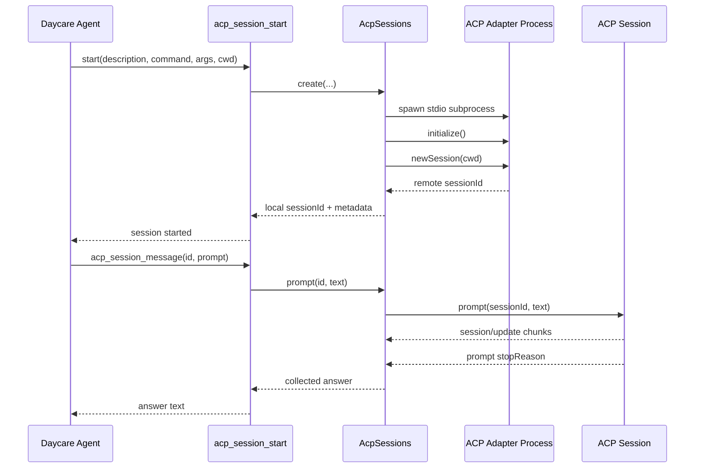

# ACP Sessions

Daycare now supports launching external ACP adapters like `codex-acp` and `claude-agent-acp` as live stdio-backed sessions from core tools.

## What Changed

- Added an `AcpSessions` engine facade that owns spawned ACP adapter processes and `ClientSideConnection` instances.
- Added `acp_session_start` to launch a new ACP session with a description and adapter command.
- Added `acp_session_message` to send a prompt to an existing ACP session and wait for the reply.
- Extended `topology()` to expose active ACP sessions, including the creator agent identity.

## Notes

- ACP adapters are not bundled into Daycare. They stay external and can be launched from `PATH`, `npx`, or an absolute executable path.
- The initial implementation keeps ACP sessions in memory for the current runtime process.
- Permission requests from ACP adapters are auto-resolved per session with either `allow` or `deny` mode.

## Flow



## Topology

```mermaid
flowchart TD
    T[topology()]
    A[storage.agents]
    S[AcpSessions.list()]
    R[TopologyResult]

    T --> A
    T --> S
    A --> R
    S --> R
    R --> O[acpSessions[] with ownerName]
```
