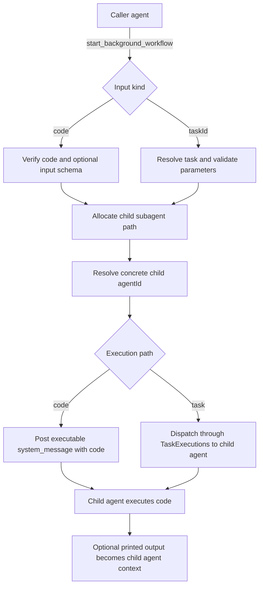

# Background Workflow Tool

## Summary

Added `start_background_workflow`, a new core tool that starts a fresh subagent and kicks it off with executable work instead of a plain prompt.

- Inline Python code can run first inside the new child agent.
- Stored tasks can run first inside the new child agent.
- Stored-task execution reuses the shared `TaskExecutions` facade.
- Inline code is verified up front with `rlmVerify`.
- Task parameter validation matches `task_run`.

## Flow

