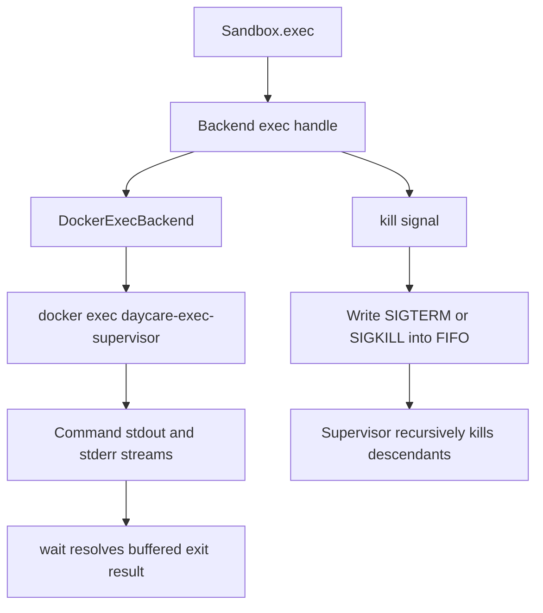

# Sandbox Streaming Exec And Tree Kill

`Sandbox.exec()` now returns a live execution handle instead of only a buffered result.
This keeps command stdout/stderr streamable while still allowing existing tools to use
`Sandbox.execBuffered()` for the old buffered contract.

## Docker Path

The Docker backend now wraps each `docker exec` with a small runtime helper:

- `daycare-exec-supervisor` starts the command
- the helper creates a FIFO control file under `/tmp/daycare-exec-*.ctl`
- `kill()` writes a signal name into that FIFO
- the helper walks descendants with `pgrep -P` and signals the full tree

## Flow

## Notes

- OpenSandbox now exposes the same `stdout` / `stderr` / `wait()` / `kill()` shape.
- Docker integration tests now use per-test sandbox user ids so parallel Vitest workers do not
  collide on one shared sandbox container.
- The live Docker test treats zombie child processes as already terminated, which matches the
  intended process-tree kill behavior.
