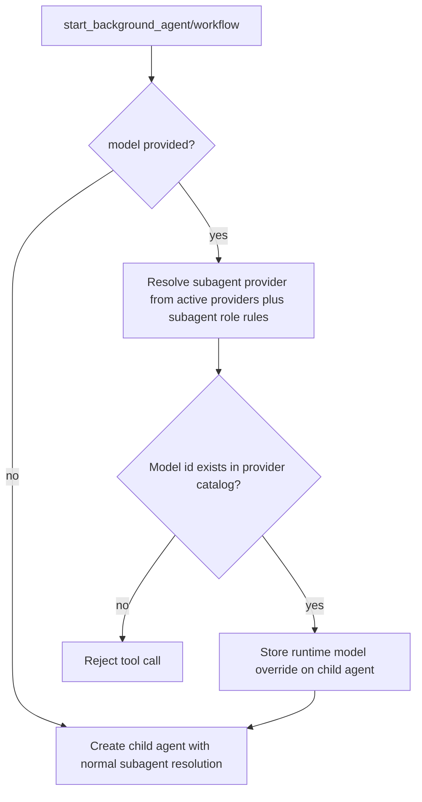

# Background Start Raw Model Override

## Overview

`start_background_agent` and `start_background_workflow` now accept an optional `model` field.
The value must be a raw provider-native model id for the resolved subagent provider. Flavor values such as
`small`, `normal`, `large`, or custom flavor names are rejected.

## Flow

## Notes

- Validation is catalog-based and happens before the child receives its first message or workflow task.
- The stored override is a direct raw model id, not a role/flavor selector.
- This keeps `set_agent_model` behavior unchanged while allowing one-off child starts on a specific checked model.
