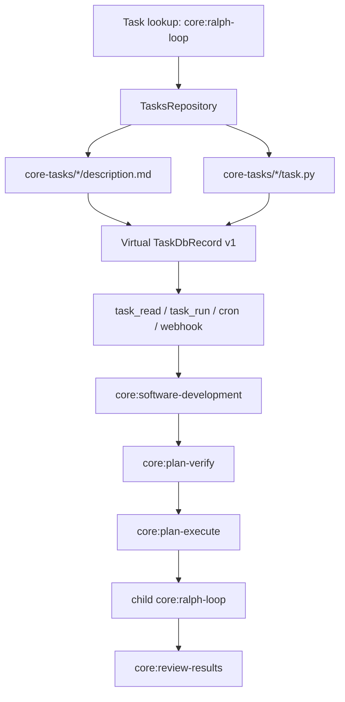

# Core Tasks

Core tasks are bundled with the repo and resolved from files instead of the `tasks` table.
They use the reserved `core:<name>` namespace, are always exposed as version `1`, and cannot be
updated or deleted through task APIs.

The bundled orchestration set is now:

- `core:ralph-loop`
- `core:plan-verify`
- `core:plan-execute`
- `core:section-execute-commit`
- `core:review-results`
- `core:software-development`

`core:software-development` is now the raw-request entrypoint. It creates the plan/validate/delegate
flow, and `core:ralph-loop` remains the execution coordinator once a plan path exists.

