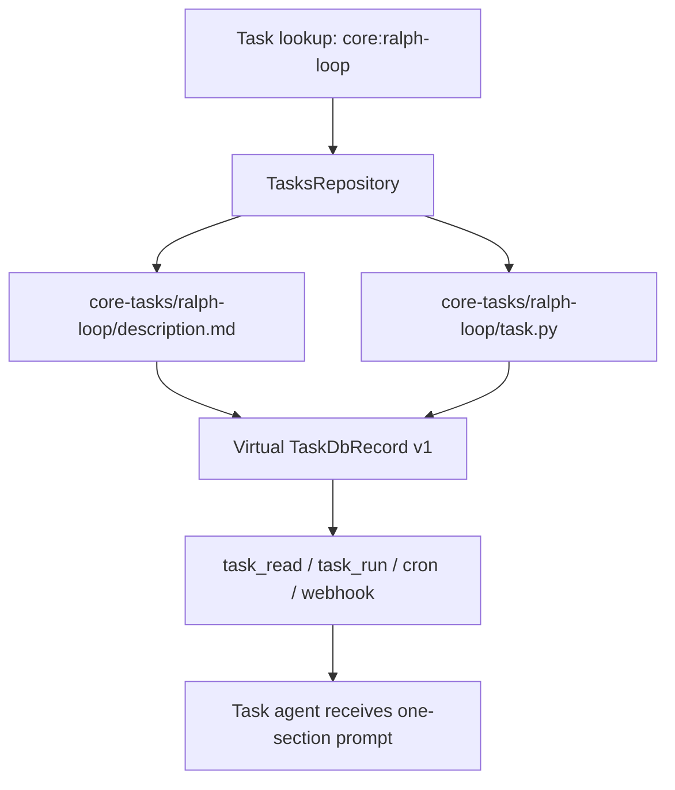

# Core Tasks

Core tasks are bundled with the repo and resolved from files instead of the `tasks` table.
They use the reserved `core:<name>` namespace, are always exposed as version `1`, and cannot be
updated or deleted through task APIs.

The first bundled task is `core:ralph-loop`, a file-backed task modeled on ralphex's task
execution phase. It reads a markdown plan, picks the first incomplete `Task` or `Iteration`
section, carries forward validation commands, and hands a one-section-only execution prompt to the
task agent.

