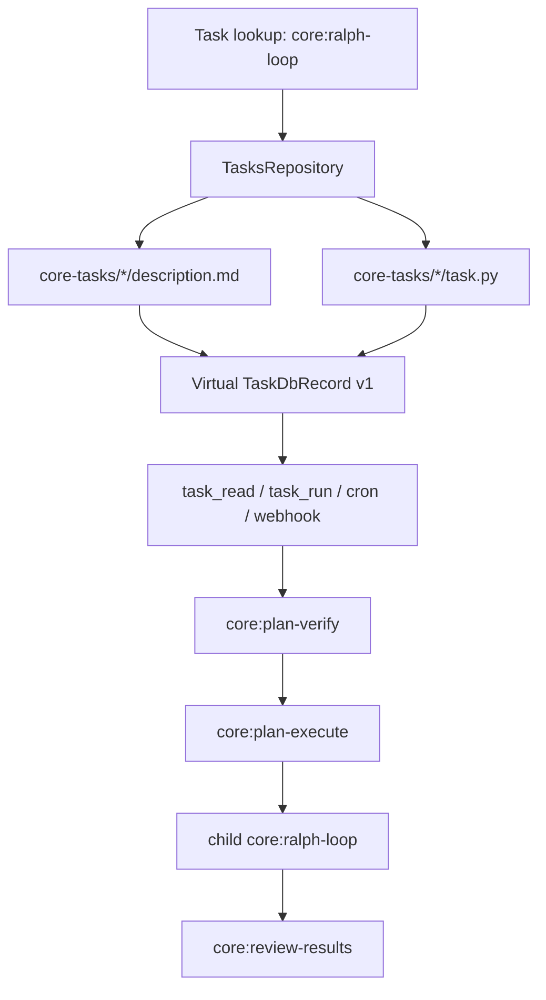

# Core Tasks

Core tasks are bundled with the repo and resolved from files instead of the `tasks` table.
They use the reserved `core:<name>` namespace, are always exposed as version `1`, and cannot be
updated or deleted through task APIs.

The bundled orchestration set is now:

- `core:ralph-loop`
- `core:plan-verify`
- `core:plan-execute`
- `core:section-execute-commit`
- `core:review-results`

`core:ralph-loop` is the top-level entrypoint. It validates the plan format, delegates execution to
the plan runner, and uses child Ralph loops plus review tasks to work through the remaining task
queue.

