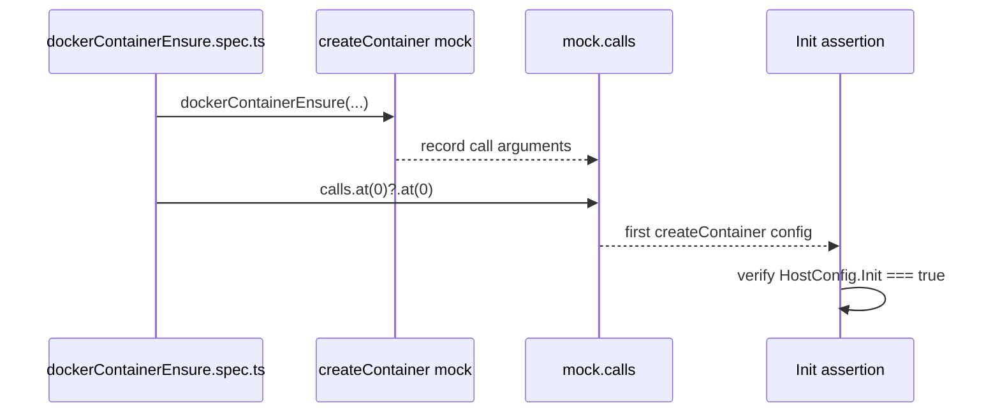

# Docker Container Ensure Build Fix

## Summary

The Docker container ensure spec now reads the mocked `createContainer()` arguments through `Array.prototype.at()` and optional chaining instead of unchecked tuple indexing.

- preserves the existing `HostConfig.Init === true` assertion
- satisfies strict TypeScript checks during the CLI build
- keeps the change isolated to the spec that was failing `yarn build`

## Flow

