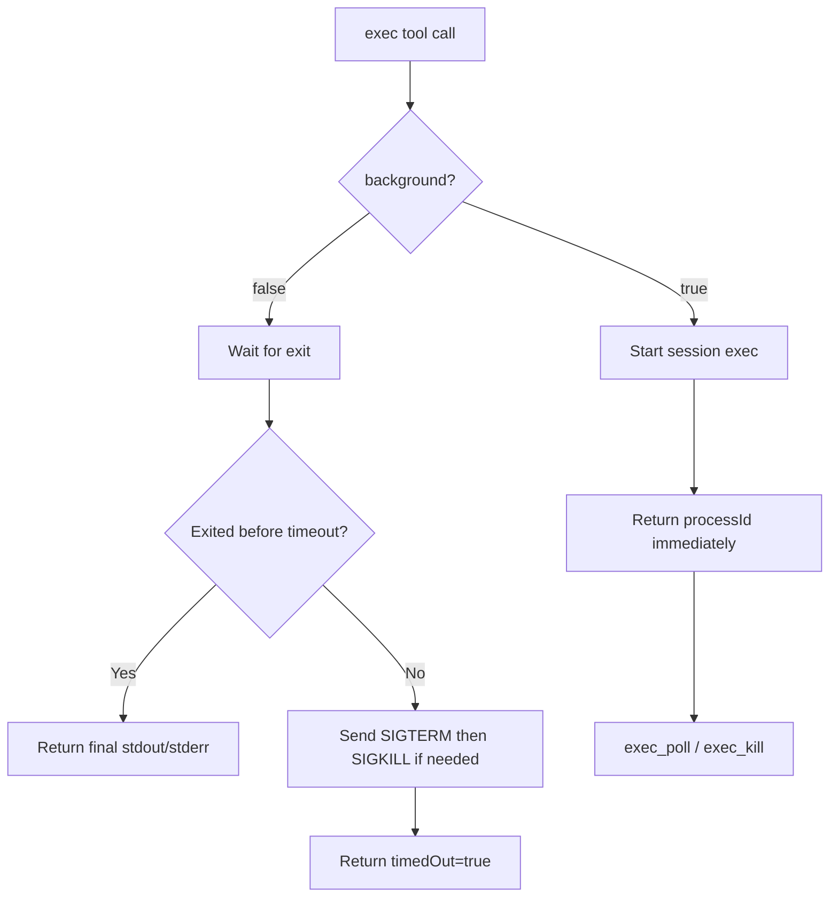

# Exec Background Flag

`exec` no longer backgrounds commands implicitly. Foreground runs now wait for completion and kill the command on
timeout, while `background: true` opts into session-scoped background execution.

## What Changed

- Replaced `detachOnTimeout` with an explicit `background` flag on the shell `exec` tool.
- Foreground `exec` now keeps waiting through intermediate stdout/stderr updates instead of returning early with a
  live `processId`.
- Foreground `exec` stops the command when `timeoutMs` is hit and reports `timedOut: true`.
- `background: true` returns a `processId` immediately for `exec_poll` / `exec_kill`.

## Flow

