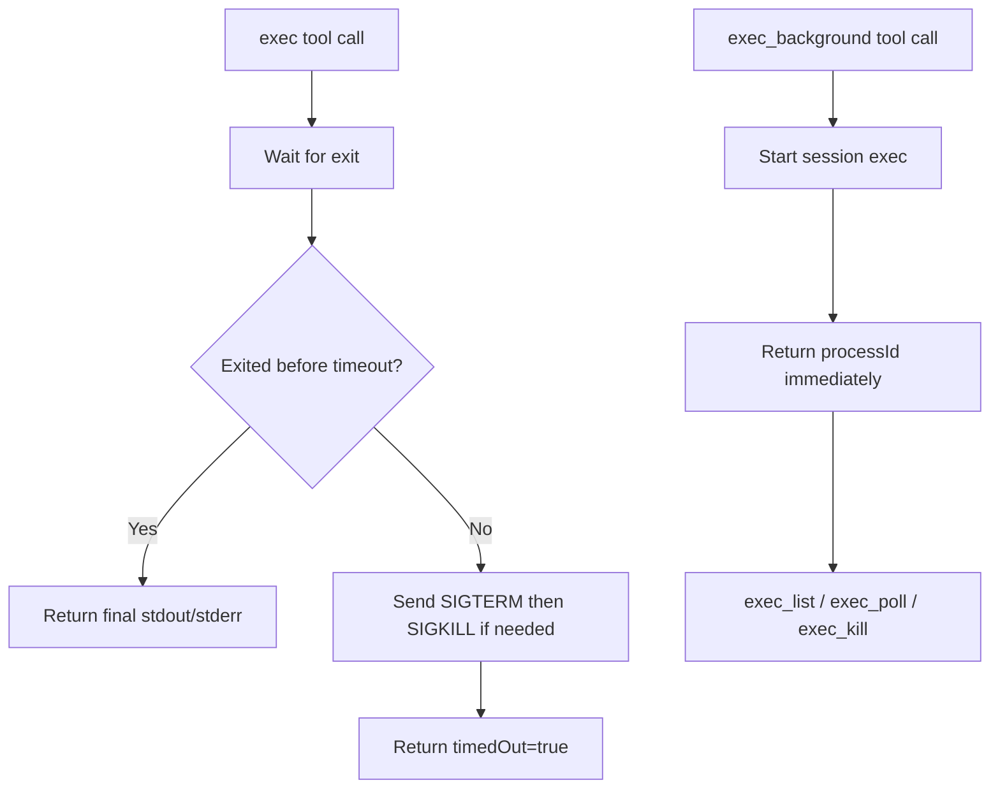

# Exec Background Tool

`exec` no longer backgrounds commands implicitly. Foreground runs now wait for completion and kill the command on
timeout, while `exec_background` opts into session-scoped background execution.

## What Changed

- Replaced `detachOnTimeout` with a dedicated `exec_background` shell tool.
- Foreground `exec` now keeps waiting through intermediate stdout/stderr updates instead of returning early with a
  live `processId`.
- Foreground `exec` stops the command when `timeoutMs` is hit and reports `timedOut: true`.
- `exec_background` returns a `processId` immediately for `exec_poll` / `exec_kill`.
- `exec_list` reports the currently active background exec processes for the current session.

## Flow

