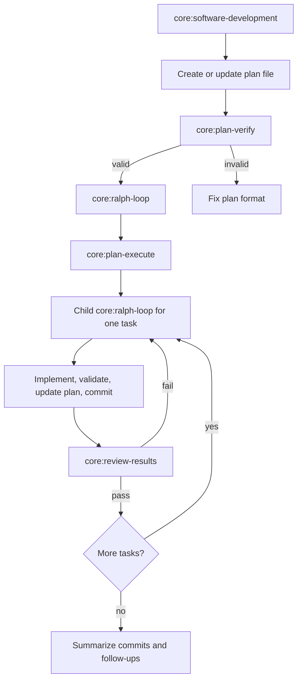
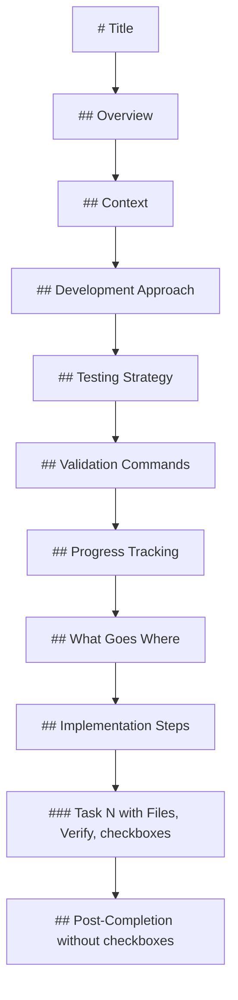

# Ralph Loop V2

The Ralph loop now covers planning, execution, review, and recursive delegation through built-in
core tasks. The plan format is explicit enough for `core:plan-verify` to reject malformed plans
before any worker starts, and the execution loop now passes plan context plus the remaining task
queue into delegated subagents.

Bundled core tasks in the loop:

- `core:software-development`
- `core:ralph-loop`
- `core:plan-verify`
- `core:plan-execute`
- `core:section-execute-commit`
- `core:review-results`

Expected plan shape for the loop:

